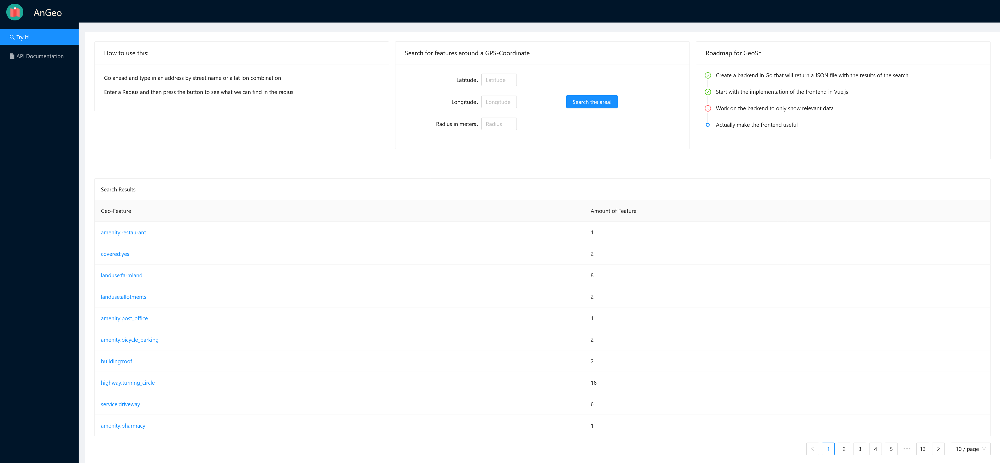

# geo-feature-service-frontend

This project is a frontend for the geo-feature-service, that I have created
in [Go](https://github.com/ViktorWelbers/geo-feature-service), which has to be in place to use this frontend.

It doesn't have much functionality, but it is rather meant as a proof of concept.

Once the backend has been set up, you can use the frontend to find out about geographical features in a radius
of a given location. For that, just enter Latitude, Longitude and the Radius in the form and click the
"Search the area" button.

## Screenshot



## Project setup

```
npm install
```

### Compiles and hot-reloads for development

```
npm run serve
```

### Compiles and minifies for production

```
npm run build
```

### Lints and fixes files

```
npm run lint
```

### Customize configuration

See [Configuration Reference](https://cli.vuejs.org/config/).
